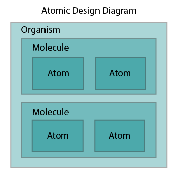
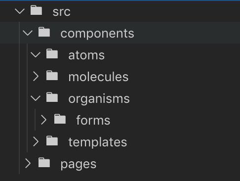

# ABEM

ABEM is a variant of BEM with slightly different syntax.



Basic structure for ABEM block name looks like this:

```
[a/m/o]-blockName__elementName -modifierName
```

* Atoms are super simple components that generally consist of just a single element (e.g. a button component);
* Molecules are small groups of elements and/or components (e.g. a single form field showing a label and an input field). 
* Organisms are large complex components made up of many molecules and atom components (e.g. a full registration form).


## Modifiers in ABEM

```html
<button class="a-blockName__elementName -small -green -active">
  Submit
</button>
```

```css
.a-blockName__elementName.-green {
  background: green;
  color: white;
}
```

The notable features are:

* Block, element, and modifier names are in lowerCamelCase instead of kebab-case.
* Modifiers are separate classes prefixes with a leading dash.
* You can use a namespace prefix if you’d like, typically to indicate the Atomic Design block type (Atom, Molecule, Organism, Template or Page) or to indicate that a class is meant strictly for JavaScript targeting (js-stickyHeader.)

## Example

```html
<div class="m-revealer o-accordion__section -open">
  <div class="m-revealer__trigger">
    <h2 class="m-revealer__heading">One</h2>
    <div class="m-revealer__icon"></div>
  </div>
  <div class="m-revealer__content">
    Lorem ipsum dolor sit amet...
  </div>
</div>
```

```scss
/* m-revealer component file */
.m-revealer {
    &__trigger {
        display: grid;
        grid-template-columns: 1fr 50px;

        &:hover {
            cursor: pointer;
            background: lightgrey;
        }

        .-open & {
            background: #000;
            color: #fff;

            &:hover {
                background: #1D1F20;
            }
        }
    }

    &__heading {
        margin: 0;
        padding: 10px 20px;
    }
    
    &__icon {
        position: relative;
        display: flex;
        justify-content: center;
        align-items: center;

        &::before {
            content: '';
            display: block;
            height: 0;
            width: 0;
            border-top: 10px solid #000;
            border-left: 5px solid transparent;
            border-right: 5px solid transparent;

            .-open & {
                transform: rotate(180deg);
                border-top-color: #fff; 
            }
        }
    }
    
    &__content {
        border-top: 1px solid #000;
        padding: 10px 20px;
        display: none;
        
        .-open & {
            display: block;
        }
    }
}
```

## Folder structure

Example folder structure:

```
00_base/
├  _root.scss
├  _normalize.scss
└  _typography.scss

01_atom/
└  _a-buttons.scss

02_molecule/
├  _m-teaser.scss
├  _m-menu.scss
└  _m-card.scss

03_organism/
├  _o-teaser-list.scss
└  _o-card-list.scss

04_template/
├  _t-section.scss
└  _t-article.scss

05_page/
├  _p-blog.scss
└  _p-home.scss

style.scss
```

Detailed example:

```
styles/<category>/<component-name>/<component-name>.scss
styles/<category>/<component-name>/<component-name>.twig
styles/<category>/<component-name>/README.md
styles/<category>/<component-name>/<component-name>[–<variant-name>].twig
styles/<category>/<component-name>/<component-name>.js
styles/<category>/<component-name>/<component-name>.config.json
Explanation
```

A simpler approach would be:




## Useful links

* [css-tricks](https://css-tricks.com/abem-useful-adaptation-bem/);
* [imarc-github](https://imarc.github.io/boilerplate-components/pattern-library/docs/abem.html);
* [BEM & Atomic Design](https://www.lullabot.com/articles/bem-atomic-design-a-css-architecture-worth-loving);
* [Atomic Design](https://www.lullabot.com/articles/bem-atomic-design-a-css-architecture-worth-loving).