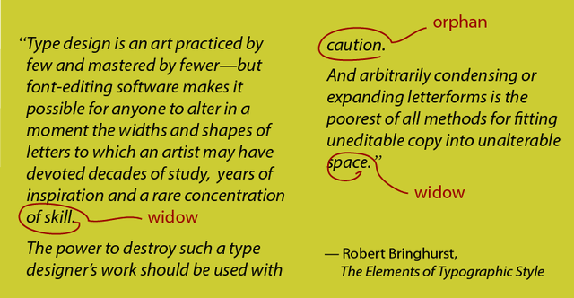
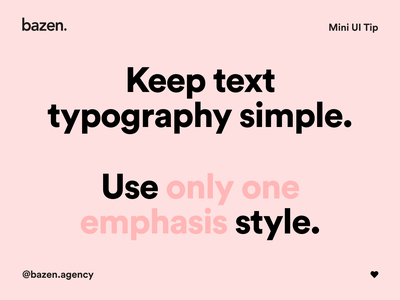
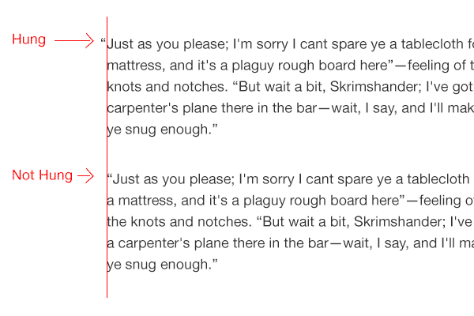
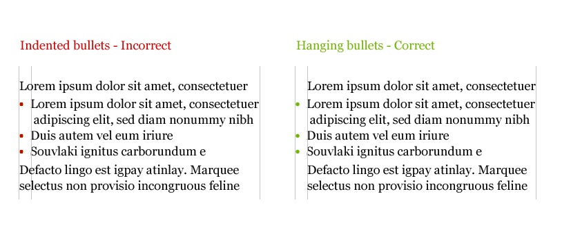
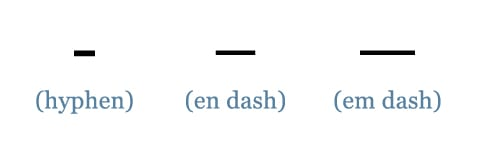

# Typography

These are basic concepts of typography:
1. Legibility;
    - Upper case letters are considered more difficult to scan than lowercase;
    - A regular type is more legible than italics;
    - Good contrast increases readability, as does appropriate line length and height;
    - The upper half of a letter is more important for scanning.
2. Readability;
3. Measure (line length);
    - Optimal line length counts somewhere between 45 and 75 characters (spaces and punctuation included);
    - 66 chars are perfect line length;
    - Try to align text to the left.
4. Line height; 
    - Line height should be at least 150% (by average it measures 148%) of font size;
5. Tracking (letter-spacing);
    - Always check "AV", "ft", "co" and "vv - w" if using smaller kerning.
6. Word spacing;
    - Shorter lines warrant less word spacing;
    - Longer lines often benefit from more word spacing (especially if they have generous line-height).
7. Typographic color;
    - A block of text should have a uniform tone (if you squint and look at it on the screen);
    - Nothing should jump out it. If it does reading flow will be broken.

## General terms

* Accent is a diacritical mark near or through a letter for example "ó";
* Axis is a real or imaginary line on which letterform rotates;
* Baseline is a line upon which the letters appear to rest;
* Bowls are round or elliptical forms that are the basic body shapes of letters, for example, C, G, O and b, c, e, or o;
* Cap height is the height of uppercase letters;
* Counter is the white space enclosed in a letterform;
* Crossbar is a horizontal stroke that connects two strokes in capital letters (H for example);
* Drop Cap is large initial capital in a paragraph; 
* Glyph is every character in the typeface;
* Ligatures are conjoined letters;
* Majuscule is a capital letter;
* Terminal is an end of a stroke that does not include serif;
* x-height is the height of the lowercase letters (exemplified by x).

## Tips and tricks

* Set font-size to 62.5% and you'll get one em amounting exactly 10px (it's easier to calculate);
* Use em units to calculate proportions between fonts;
* 30 to 50 ems can be seen as ideal line length;
* Always try to maintain a vertical rhythm. You can use this formula to calculate a heading line-height: basic line-height/heading font-size = heading line-height;

## A word about vertical rhythm

Vertical rhythm is not always possible, especially when dealing with multiple images of various sizes, however, it's still and admirable goal.


## Hierarchy and Scale

A size of the text elements should be based on a typographic scale (and importance). It might be a traditional scale:

6, 7, 8, 9, 10, 11, 12, 14, 16, 18, 21, 24, 36, 48, 60, 72

Or the Fibonacci:

16, 24, 40, 64, 104

Also, you can use a [generator](https://www.modularscale.com/). 

__Interesting fact__: Some people set a font size to 0.625 em (62,5%) for easier calculations based on a 10px size.

## Paragraphs

Paragraphs are punctuation of ideas. The single-line boundary is the most common paragraph delimiter. 

If you use the indent, convention suggests that paragraphs that follow a heading or sub-heading should not be indented. Also you should not indent lines of text after lists and block quotes. 

A simple trick to accomplish that is use of an adjacent selector:

```css
p { 
    text-indent: 2.5em; 
}

h1 + p, 
h2 + p, 
h3 + p {
    text-indent: 0;
}
```

### Drop cap (versal)

A drop cap is a large first letter in the first paragraph. 

### Outdent cap

An outdent cap is the first letter outside of a text.

### Make the first line small caps

There is a trick to turn the first line of a text to small caps (or do whatever you want with it).

```css
p::first-line {
    font-variant: small-caps;
}
```

Check [this article](https://www.smashingmagazine.com/2012/04/drop-caps-historical-use-and-current-best-practices/), here you can learn more about first lines in typography.

## Right type

__Important__: The most important criterion is the context in which the typeface will be used and the purpose it will serve.

For enacted narratives, we can read the text beforehand, understand its meaning, tone and nuances. But what do wee do for emergent narratives? 

Look at the brand and environment. Imagine the context in which text will be read. Choose a type that enriches the meaning of the text but faes into the background rather than clamors for attention.

### Workhorse fonts

Workhorse typefaces have sturdy features: conventional and easy recognizable letterforms, generous letter spacing, solid serifs, clear open counters, a tall x-height and ink traps. 

Their character isn't overbearing or evocative so they capable of setting many different kinds of content.

### Display typefaces

A display typeface is intended for use at large sizes for headings, rather than for longer passages of body text.

[Display category on Google Fonts](https://fonts.google.com/?category=Display)

Workhorse typefaces are more flexible than display typefaces. To some extent, one can wear hiking shoes to a posh reception. If you combine them with casual jeans and stylish shirt and jacket, you might get away with it, just as workhorse typefaces might look acceptable in headlines if you adapt their spacing and use them with in combination with the right design elements. But you wouldn't climb a mountain in dancing shoes. Never use display typefaces for body text.


### Font quality checks

* Check them at 100 to 150 points,
* Check italics readability,
* Check small caps clarity,
* Check word rococo;
* Check word lol0;
* Check words floria and Eigenschaft for proper ligatures.

### Sans or serif? ... Or monospace or cursive?

Familiar letterforms. Choose a face with customary shapes. Avoid quirky typefaces. Never set body copy in all capitals or all small-caps. Be careful with italics and obliques (and other variations). Choose a font whose ascenders for letters such as "b" and "d" rise above x-height, and vice-versa for "p" and "q". 

True fonts, not synthetics! Use only these fonts that have designed other variants such as bold and italics.

Generous x-height. Fonts designed for the screen have a generous x-height (you can check this on x letter).

Comfortable letter spacing. Should be good without CSS fixing.

Comfortable word spacing. Same as above.

### Details

Combining serif and sans-serif is a popular trick. But you must remember that both fonts must have the same x-height.

#### Widows & orphans

* A widow is a paragraph ending line that falls at the beginning of the following page/column.

* An orphan is a word, part of a word, or very short line that appears by itself at the end of a paragraph.



In simple words: be careful with a single words in the end of a paragraph and a short sentences in new columns.

#### Emphasis

Use only one type of emphasis. Select from bold, small caps, italics, type size, color and other typeface. 



#### Hanging punctuation

Always pull your punctuation outside the text.



__Notice:__ For hanging punctuation, you can use negative `text-indent` value.



#### Ampersand with style

It's a good idea to use special font for ampersands to make them more decorative.

#### Do not use hyphen for em dash

You should always use `&#8212` for text an interruption. 



#### Always use proper quotes

Quote chars depend on a language that you use. 

You can style quotes using this CSS:

```css
:lang(en-us) > q {
    quotes: "\2018" "\2019" "\201c" "\201d";
}
```

__Notice:__ These: `"` are called dumb quotes.

#### Treat text as a user interface

If you want your content to convey a function as well as a meaning and to help your users understand how they are supposed to achieve they goal with your text, you'll have to include subtle visual cues. 

#### Quotes

* Block quote is used for long quotations that are apart from the main body. This refers external source or other article. 

* `<q>` is used for inline quotations. It might be used  instead of quotation marks (add them using CSS).

* `<cite>` is used when you reference externally sourced quotes.

#### Hyphens and special chars

* `-` hyphen is not a minus char `−` or dash `—`. It's used to wrap words. There is soft hyphen `&#173;` and hard hyphen that is always visible.

* `– —` en and em dash are used to indicate range for example: (2.00 – 3.00 p.m.) or group (Meyer–Stevenson Lexicon).

* `—` em dash has 1em of width, and it's used to interrupt a sentence `I was debugging the style sheet — wait a second what was he saying?`. Some dashes benefit from having spaces around them; for instance, the em dash can be surrounded by a thin (`&#8201;`) or hair (`&#8202;`) space.  

* A single prime (′) should be used to represent feet and minutes, and double prime (″) for inches and seconds. 

* Use ellipsis (`&#8230`) instead of triple periods. 