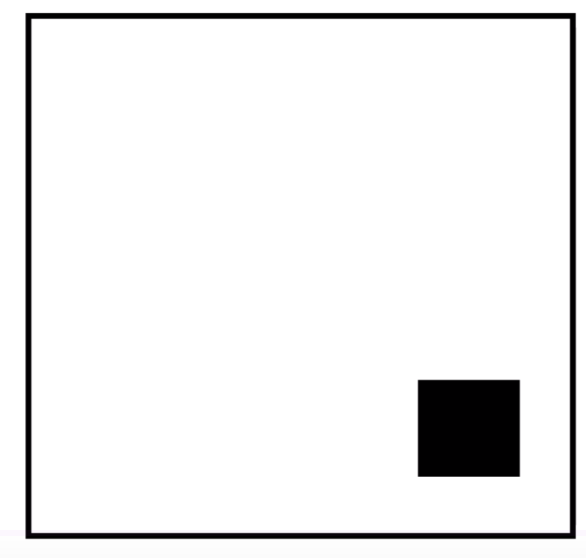
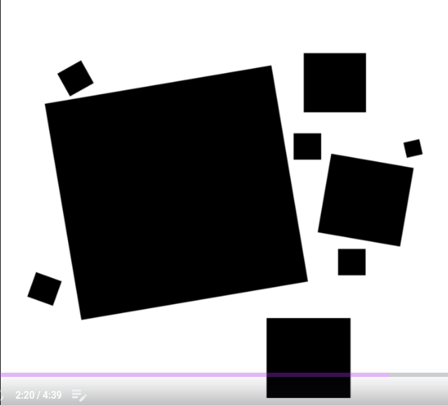
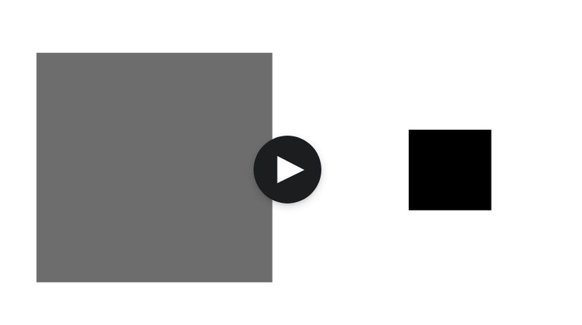
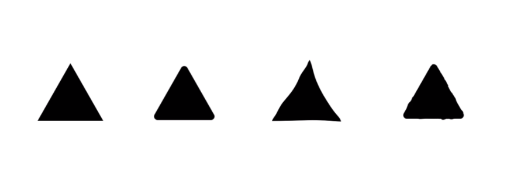
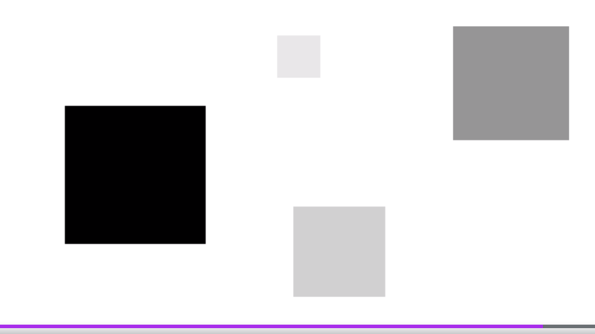
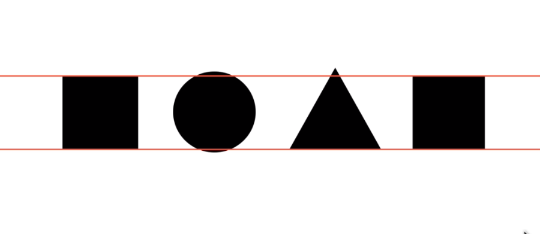
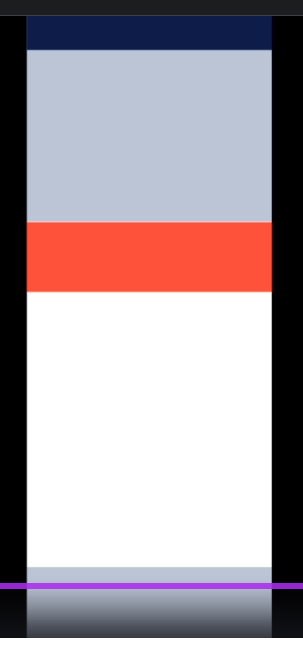

# UI design Bootcamp

John Constable - first painter that used advanced composition.

First think about composition! Not colors or typography.

> Exercise 1: draw square compositions on paper.

## Expression

> Exercise 2: convey emotion using composition of squares.

## Balance

You can try to find balance between sides of composition using color or different shapes.

> Exercise 3: Create balanced composition using two-three squares. You can play with darkness and size.

## Contrast

Use rules:

* Limit shapes.
* Limit colors.
* Use grid.

> Exercise 4: create contrasting compositions (three, four elements).

## Form

Form can determine meaning for e.g. rough triangle could mean technology company, hand drawn triangle means something casual etc.

Form can add to contrast also.

## Hierarchy

You should tell your user what he should look up first (news pages are based on a hierarchy). We should avoid multiple things with the same importance. We should ease the selection of what comes first.

> Exercise 5: convey hierarchy using all rules discussed before.

## Relations

If more things follow the same pattern, they look less important. You can use different techniques to relate elements.

> Exercise 6: draw some figures and group them.

## Alignment 

Use grids! Push circles & triangles little out of the line.

> Exercise 7: use alignment to recreate your recent compositions.

## Sequence & pace

Monotonous compositions make you sleepy. It works line music. Rhythm must be interesting. In web design vertical rhythm is more important.

> Exercise 8: use vertical canvas with the horizontal grid. Create interesting beat. Add some figures using previous knowledge.