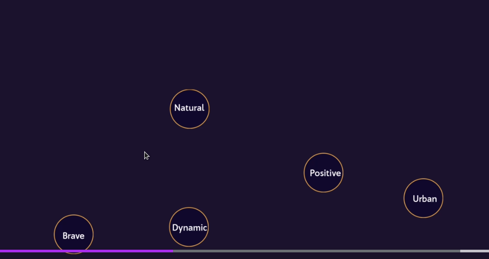

# Selecting typefaces

> Look for inspiration regularly! Good artists copy, great artists steal!

> Search Design Inspiration for a web typography!

## Define the brand 

* Write adjectives that describe best your brand (for e.g. fun, quirky, urban, familiar, dynamic, collaborative etc.).
* Find similar ones, decide which ones are better and remove those redundant. 
* Find only five unique ones, that are best describing your brand personality, and remove rest of them.

It's easier to create a design that communicates brand personality. It will be easier to convince your client to such project.

> Display is a special font designed for headings.

> Variable fonts have variable font-weight (you can adjust that from 1 to 999).

> Adobe has great font library.