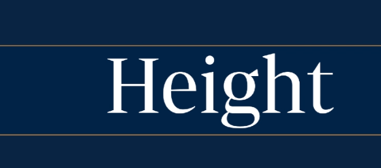
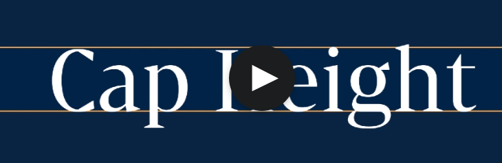
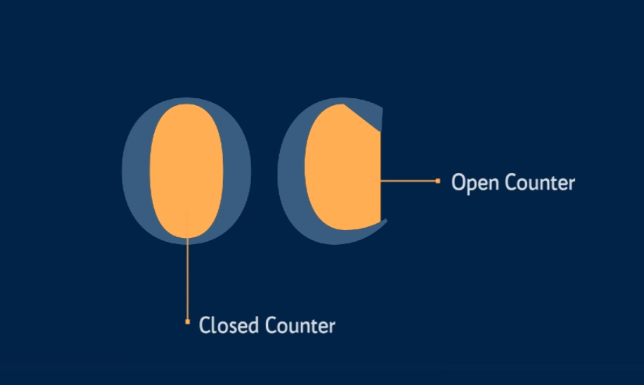
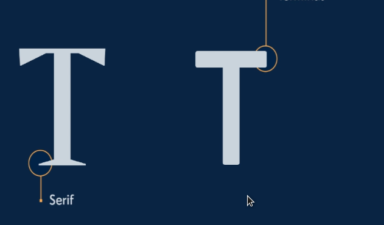
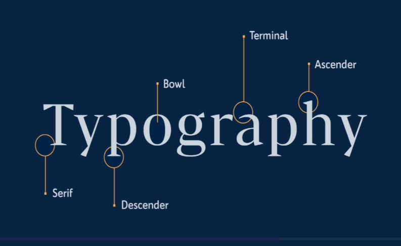

# Typographic classifications

> Steve Jobs studied calligraphy and was interested in typography. That's the secret of iOS!

* Typography makes up 95% of most web applications
* Steve Jobs studied it

## Typeface or font?

Typeface - overall artwork.

Font - type of software (file).

Typography / typographic system - the art and decisions we make when laying on type.

Glyph - individual symbol in a font file

## Web typography

Do not use too much font files.

With the web we design the system before existing copy.

## Non-verbal communication

Some communication is non-verbal, but it's much less than 93%.

Typography is emotional communication.

We trust emotional communication more.

## Type anatomy

`Height` - overall height of a type.

`Cap height` - how high the capital letters are.

`x-height` - height of lower case letters.

`Ascender and descender` - bit below and above the line (x-height).

`Stroke` - the line that makes a letter. 

`Stem` - Vertical line that makes a T.

`Bar or Crossbar` - is a horizontal line like in an A. 

`Spine` - curved letters part (for e.g. `S`).

`Bowl` - rounded part of letters like in `a`.

`Closed counter & open counter` - Closed area of letter.

`Serif` - font decorators

`terminal` - closing of a sans-serif font.

`Overshoot` - serif wider than letter.

`Arm & leg` - diagonal parts, facing up and down, of letters (like `k`).

`Shoulder` - rounded upper portion of letter like in a `n`.

`Tail` - like in `Q`.

`Swash` - letter decoration that isn't important for recognition. 

