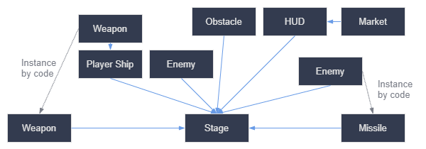

# First steps

## Creating instances

Once you've saved a scene you can use it multiple times. This process is called instancing. 

You can modify each instance of the scene separately.

> To add an instance to the `Main` scene click `link` icon over scene tree.

> To duplicate a scene use `Ctrl + D`.

> You can make all scenes inherit new settings by editing original `tscn` file. It works automatically.

> If you change physics material in any of the instances, it will affect all of them. That's because it's a resource, you must click "make unique" to change that.

## Design language



Instead of learning programming patterns, describe your game as diagram. Create a scene for each diagram rectangle (each one is entity visible to the player).

Instancing, the process of producing an object from a blueprint has many handy uses. With scenes, it gives you:

* The ability to divide your game into reusable components.

* A tool to structure and encapsulate complex systems.

* A language to think about your game project's structure in a natural way.


## Scripting languages

Scripts are attached to a node and extend its behavior, so they inherit all functions and properties of the node.

> You can use multiple languages in one project.

> There are more resources concerning GDScript than C#.

> VisualScript should be used only for parts of games (like quest designs etc.)

> You can write parts of your game in C or C++ (if performance is required).

## First script

For example create a `sprite` scene. 

> You can create sprite nodes by dragging image files on workspace.

In a tree view select `attach script` from the right click menu.

Select `empty` template. 

> Every script is a class by default. There's `extends` keyword on the top. 

> Property names are transformed to snake case by default. 

```gdscript
func _init():
    print("Hello, world!")
```

This way you'll output words in a `Output` window.

> `_init` is a class constructor.

### Let's make sprite turning around

```gdscript
extends Sprite

var speed = 400
var angular_speed = PI
```

These are member variables. Every node instance will have these copied.

> Angles in Godot are radian based.

> `update` function in Godot is called `_process()` and it runs every frame. This function has `delta` delta argument which is a time since last frame. This allows you to animate independent of frame rate.

> Godot's virtual functions are underscored. 

```gdscript
extends Sprite
var speed = 400
var angular_speed = PI

func _process(delta):
	rotation += angular_speed * delta
```

This code will rotate sprite. `roatation` is inherited from `Node2D`.

```gdscript
extends Sprite
var speed = 400
var angular_speed = PI

func _process(delta):
	rotation += angular_speed * delta
	var velocity = Vector2.UP.rotated(rotation) * speed
	position += velocity * delta
```

This code will rotate object with different pivot.

To make the node move forward, we start from the Vector2 class's constant `Vector2.UP`, a vector pointing up, and rotate it by calling the `Vector2.rotated()` method. This expression, `Vector2.UP.rotated(rotation)`, is a vector pointing forward relative to our icon. Multiplied by our speed property, it gives us a velocity we can use to move the node forward.

https://docs.godotengine.org/en/stable/getting_started/step_by_step/scripting_player_input.html